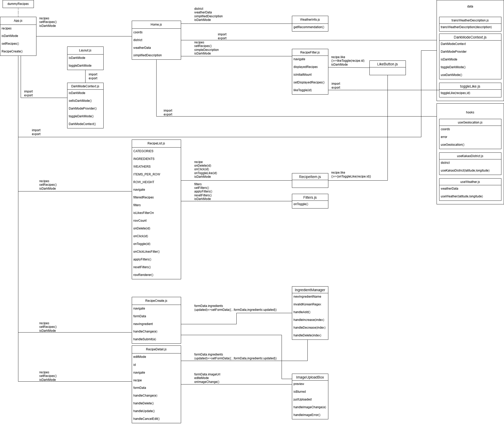

# 🌤️ 오늘 뭐 먹지 - 날씨 기반 음식 추천 웹 애플리케이션

## 📌 기획의도
저희 프로젝트 "오늘 뭐 먹지"는 **날씨에 따라 적합한 음식을 추천하는 웹 애플리케이션**을 개발하고자 시작되었습니다.  

기존의 레시피 추천 사이트들은 날씨 정보를 반영한 음식 추천 기능이 부족하며, 사용자가 **선호하지 않는 재료를 필터링**하는 기능 역시 제공하지 않는 경우가 많습니다.  

이러한 한계를 보완하기 위해, 저희는 **사용자 맞춤형 음식 추천 + 개인화된 재료 필터링 기능**을 결합한 서비스를 기획하게 되었습니다.

🔗 참고 사이트: [만개의 레시피](https://www.10000recipe.com/)  
- 기존에는 좋아하는 종류, 상황, 재료, 방법, 테마 등만 필터링 가능  
- 저희는 **싫어하는 재료 필터링** 및 **날씨별 추천 기능**을 추가하였습니다.  

메인 화면에서는 **사용자 지역의 날씨에 따라 어울리는 레시피 4개**를 제안합니다.

📘 프로젝트 노션: [React Project Notion](https://www.notion.so/React-Project-5-28caa939b4b3808eb6d8c6c5236f855b)

---

## ⚙️ 구현할 핵심 기능

### 🧾 CRUD 기능
- 새로운 레시피를 사용자가 직접 등록할 수 있음  
- 등록된 레시피 및 기존 레시피 조회 가능  
- 기존 레시피 수정 가능  
- 저장된 레시피 삭제 가능  

---

### 🧭 SPA (Single Page Application)
- **React Router**를 이용하여 네비게이션바 클릭 시 페이지 전환  
  - 오늘의 추천  
  - 전체 레시피  
  - 레시피 추가  

---

### 📜 가상 스크롤
- **React-Virtualized**를 사용하여 2,500개 이상의 데이터를 효율적으로 렌더링  
- 브라우저 성능 저하 방지  

---

### ⚡ 코드 스플리팅
- **React.lazy** + **Suspense**를 사용하여 이미지가 많은 페이지의 초기 로딩 속도 개선  

---

### 🌍 외부 데이터 연동
- **Geolocation API**를 사용해 사용자 위치(위도, 경도) 확인  
- **Kakao Map API**로 지역명(구/군) 조회  
- **OpenWeather API**로 지역의 날씨 정보 확인  

---

### 📱 반응형 웹
- **PC / 태블릿 / 모바일** 환경 대응  
- 네비게이션바 및 메인 화면 반응형 디자인 적용  

---

## 👥 팀원 역할 분담

### 👩‍💻 김지원
- 주제 선정 및 일정 수립  
- 역할 분담  
- 레시피 더미 데이터 제작  
- 전체 레시피 페이지 UI 구현  
- 가상 스크롤(React-virtualized) 기능 구현  
- 사용자 레시피 필터 기능 구현  
- 레시피 삭제 및 수정 반영 기능 구현  
- 페이지 CSS 통일 및 UI 개선  
- SPA 라우팅 기능 구현  
- 코드 통합  

---

### 👨‍💻 박건영
- 이미지 업로드 및 미리보기 기능 구현  
- SPA 라우팅 기능 구현  
- 레시피 클릭 시 상세 페이지 이동  
- 네비게이션으로 상세페이지 이동  
- useParams를 이용한 ID별 상세 표시  
- 삭제 시 홈으로 이동  
- 더미데이터 작성 및 구조 정리  
- 수정 모드 기능 구현  
- 이미지 업로드 박스 개선  
- 상세 페이지 UI 및 기능 구현  
- 추가 페이지 UI 및 기능 구현  
- CSS 분리 및 정리  
- 코드 통합  
- Lazy & Suspense 기능 구현  

---

### 👨‍💻 한해찬
- **OpenWeatherMap API** 적용  
- 날씨 API와 더미데이터의 **날씨 필터링 기능 구현**  
- 네비게이션 바 UI 및 기능 구현  
- **KakaoMap API**로 현재 사용자 지역 출력  
- **OpenWeather 아이콘**을 날씨 상태에 따라 변경  
- 메인 페이지 **좋아요 버튼 기능 구현**  
- Flow Chart 제작  
- 메인 페이지 UI 및 기능 구현  
- 기능별 컴포넌트 분리  
- 레시피 클릭 시 상세 페이지 이동  
- **다크모드 기능 구현**  
- 코드 통합  
- SPA 라우팅 기능 구현  

---

## 🧩 Flow & UI

### 🧭 Flow Chart

