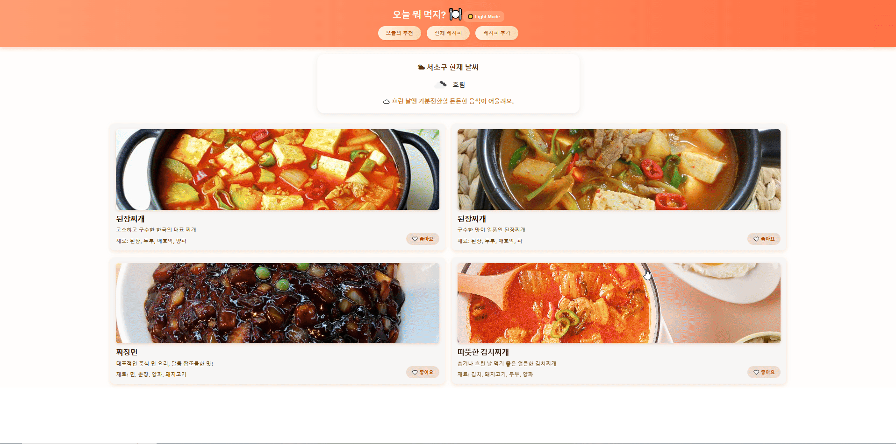
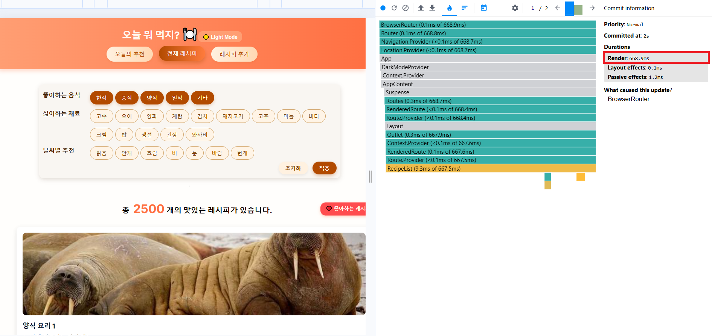
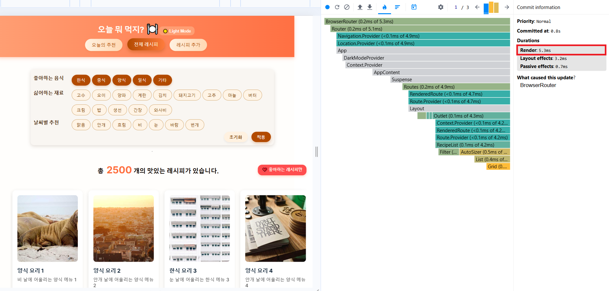
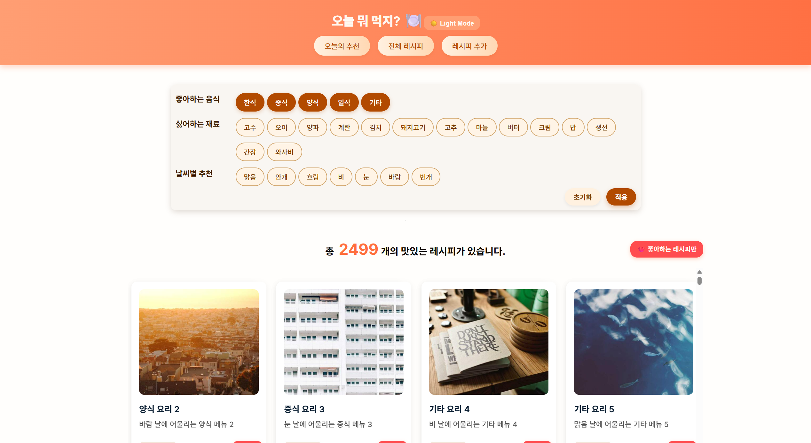
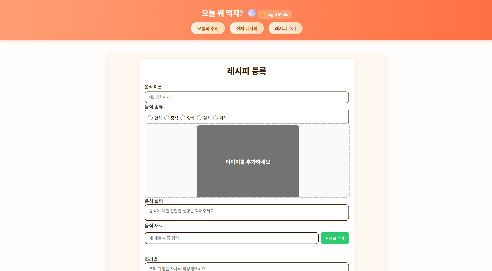
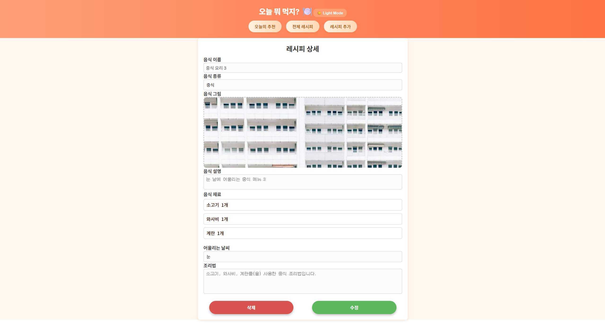

# 🌤️ 오늘 뭐 먹지 - 날씨 기반 음식 추천 웹 애플리케이션

## 📌 기획의도
저희 프로젝트 **"오늘 뭐 먹지"** 는 **날씨에 따라 적합한 음식을 추천하는 웹 애플리케이션**을 개발하고자 시작되었습니다.  

기존 레시피 추천 사이트는 날씨 정보를 반영하지 못하거나, 사용자가 **싫어하는 재료를 필터링**할 수 없다는 한계가 있었습니다.

이러한 한계를 보완하기 위해, 저희는 **현재 날씨에 따라 어울리는 음식을 추천**하고,**개인 취향(좋아요, 싫은 재료)을 반영**하는 맞춤형 레시피 웹사이트를 만들었습니다.

🔗 참고 사이트: [만개의 레시피](https://www.10000recipe.com/)  
- 기존에는 좋아하는 종류, 상황, 재료, 방법, 테마 등만 필터링 가능  
- 저희는 **싫어하는 재료 필터링** 및 **날씨별 추천 기능**을 추가하였습니다.  

메인 화면에서는 **사용자 지역의 날씨에 따라 어울리는 레시피 4개**를 제안합니다.

📘 프로젝트 노션: [React Project Notion](https://www.notion.so/React-Project-5-28caa939b4b3808eb6d8c6c5236f855b)

---

## 🗓️ 개발 기간
- **2025년 10월 14일 (화)** ~ **2025년 10월 20일 (월)** (총 7일)

---

## 👨‍👩‍👦 팀원

| 팀장 | 팀원 | 팀원 |
|:----:|:----:|:----:|
| [](https://github.com/jwantit) | [](https://github.com/keonyeong) | [](https://github.com/haechan419) |
| **김지원** | **박건영** | **한해찬** |

---

## 👥 팀원 역할 분담

| 담당자 | 담당 페이지 | 주요 기능/역할 |
|:--------:|:-----------------------|:--------------------------------------------|
| **김지원** | 전체 레시피 리스트 화면 | - 프로젝트 주제 선정 및 일정 수립<br>- 팀 역할 분담 및 조율<br>- 레시피 더미 데이터 제작<br>- 전체 레시피 페이지 UI 및 필터 기능 구현<br>- 가상 스크롤 및 SPA 라우팅 적용<br>- 레시피 수정·삭제 기능 연동<br>- 페이지 CSS 통일 및 코드 통합 |
| **박건영** | 새 레시피 작성 + 상세 페이지 | - 새 레시피 작성 및 상세 페이지 UI 구현<br>- 이미지 업로드 및 미리보기 기능 구현<br>- 수정·삭제 기능 및 홈 이동 처리<br>- useParams 기반 ID별 상세 표시<br>- Lazy & Suspense 적용<br>- CSS 분리 및 코드 구조 정리<br>- SPA 라우팅 및 페이지 전환 기능 구현 |
| **한해찬** | 메인 화면 (Home) | - OpenWeatherMap 및 KakaoMap API 연동<br>- 날씨 기반 레시피 필터링 기능 구현<br>- 네비게이션 바 및 메인 페이지 UI 설계<br>- 다크모드 및 좋아요 기능 구현<br>- OpenWeather 아이콘 동적 변경<br>- 기능별 컴포넌트 분리 및 코드 통합<br>- Flow Chart 제작 및 SPA 라우팅 적용 |

---

## 🛠 기술 스택

| 구분 | 내용 |
|:----:|:----|
| **언어** |   |
| **개발 도구** |  |
| **IDE** |  |
| **운영체제** |  |

---

## 💻 개발 환경

### 프론트엔드
- **React** : 18  
- **React-DOM** : 18  
- **React-Router-DOM** : 7.9.4  
- **React-Virtualized** : 9.22.6  
- **SASS** : 1.93.2  
- **axios** : 1.12.2

---

## 🗂️ 프로젝트 구조

```plaintext
index.js
App.js
src/
  ├── components/
  │   ├── common/
  │   │   ├── Filters/
  │   │   │   └── Filters.js
  │   │   ├── ImageUploadBox/
  │   │   │   └── ImageUploadBox.js
  │   │   ├── LikeButton/
  │   │   │   └── LikeButton.js
  │   │   ├── WeatherInfo/
  │   │   │   └── WeatherInfo.js
  │   ├── recipe/
  │   │   ├── IngredientManager/
  │   │   │   └── IngredientManager.js
  │   │   ├── RecipeFilter/
  │   │   │   └── RecipeFilter.js
  │   │   ├── RecipeItem/
  │   │   │   └── RecipeItem.js
  ├── data/
  │   ├── dummyRecipes_2500.js
  │   └── dummyRecipes.js
  ├── hooks/
  │   ├── useGeolocation.js
  │   ├── useKakaoDistrict.js
  │   └── useWeather.js
  ├── layout/
  │   └── Layout.js
  ├── modules/
  │   ├── toggleLike.js
  │   ├── transWeatherDescription.js
  │   └── useKakaoDistrict.js
  ├── pages/
     ├── Home/
     │   └── Home.js
     ├── RecipeCreate/
     │   └── RecipeCreate.js
     ├── RecipeDetail/
     │   └── RecipeDetail.js
     └── RecipeList/
         └── RecipeList.js
```

## ⚙️ 구현할 핵심 기능


### 🍱 **레시피 목록 표시 및 필터링**

> 사용자의 취향과 날씨에 따라 레시피를 맞춤 표시합니다.

- ✅ 좋아하는 음식만 보기  
- 🚫 싫어하는 재료 제외  
- 🌤️ 날씨별 레시피 필터링  


### ❤️ **좋아요(Like) 기능**

> 레시피 카드의 ❤️ 버튼으로 좋아요를 누르고, 좋아요한 레시피만 따로 모아볼 수 있습니다.

- 각 레시피 카드에 ❤️ 버튼 클릭 시 좋아요 반영  
- "좋아요만 보기" 기능 제공  
- 상태가 즉시 반영되고, 필터 기능과 연동됨  


### 🧾 **CRUD 기능**

> 사용자가 직접 레시피를 추가, 수정, 삭제할 수 있는 기능을 제공합니다.

- ✏️ 레시피 등록  
- 🔍 등록된 및 기존 레시피 조회  
- 🛠️ 레시피 수정  
- ❌ 레시피 삭제  

| 등록(Create) / 조회(Read) / 수정(Update) | 삭제(Delete) |
|:-----------------------------------------:|:-------------:|
|  |  |


### 🧭 **SPA (Single Page Application)**

> React Router를 활용하여 부드러운 페이지 전환을 구현했습니다.

- 🔹 오늘의 추천  
- 🔹 전체 레시피  
- 🔹 레시피 추가  


### 📜 **가상 스크롤 (Virtual Scroll)**

> 대량의 데이터를 효율적으로 렌더링하기 위해 `React-Virtualized`를 적용했습니다.

- 2,500개 이상의 레시피도 렌더링 성능 저하 없이 표시  
- 스크롤 위치에 따라 필요한 컴포넌트만 로드  


### ⚡ **성능 최적화**

> 프로젝트 성능 향상을 위해 다양한 최적화 기법을 적용했습니다.

| Before | After |
|:------:|:-----:|
|  |  |

#### 🚀 적용 기술 및 방법
- **React-Virtualized** : 대용량 데이터 렌더링 최적화  
- **Lazy Loading** : 이미지 및 컴포넌트 지연 로딩으로 초기 렌더링 속도 개선  
- **불필요한 렌더링 제거** : 상태 관리 최소화 및 의존성 정리  


### ⚡ **코드 스플리팅 (Code Splitting)**

> `React.lazy`와 `Suspense`를 이용해 초기 로딩 속도를 개선했습니다.

- 페이지별로 코드 분할  
- 이미지가 많은 페이지는 Lazy Loading으로 지연 로딩  


### 🌍 **외부 데이터 연동**

> 실시간 위치와 날씨 데이터를 통해 사용자 맞춤형 레시피 추천 기능을 제공합니다.

- 📍 **Geolocation API** : 사용자 위도/경도 확인  
- 🗺️ **Kakao Map API** : 좌표 기반 지역명(구/군) 조회  
- 🌤️ **OpenWeather API** : 해당 지역의 날씨 정보 가져오기  


### 📱 **반응형 웹 (Responsive Web)**

> 다양한 기기에서 일관된 사용자 경험을 제공합니다.

- 💻 PC  
- 📱 모바일  
- 📊 태블릿  


### 🌙 **다크모드 (Dark Mode)**

> 사용자 환경에 따라 자동으로 테마가 전환되며, 수동으로도 변경 가능합니다.

- 시스템 테마 감지 (Light / Dark)  
- 상태 저장으로 새로고침 후에도 유지  


---

## 🧭 API 명세서

본 프로젝트에서는 **OpenWeatherMap API**와 **Kakao Map API**를 활용하여  
사용자의 **현재 날씨 정보**와 **행정구역(위치)** 데이터를 실시간으로 조회합니다.

### 🌤️ 현재 위치 날씨 조회 API

| 항목 | 내용 |
|------|------|
| **기능 설명** | 위도(`latitude`)와 경도(`longitude`)를 기반으로 현재 날씨 정보를 조회합니다. |
| **요청 URL** | `https://api.openweathermap.org/data/2.5/weather` |
| **Method** | `GET` |
| **요청 파라미터** | <ul><li>`lat` : 위도 (예: `37.5665`)</li><li>`lon` : 경도 (예: `126.9780`)</li><li>`appid` : OpenWeather API Key</li><li>`lang` : 언어 코드 (`kr`, `en` 등)</li><li>`units` : 단위 (`metric` → 섭씨)</li></ul> |
| **요청 예시** | ```bash https://api.openweathermap.org/data/2.5/weather?lat=37.5665&lon=126.9780&appid=YOUR_API_KEY&lang=kr&units=metric ``` |
| **요청 헤더** | 없음 |
| **응답 형식** | `JSON` |
| **응답 예시 (성공)** | ```json { "coord": { "lon": 126.978, "lat": 37.5665 }, "weather": [ { "main": "Clouds", "description": "broken clouds" } ], "main": { "temp": 20.5, "feels_like": 20.2, "humidity": 60 }, "wind": { "speed": 3.5 }, "name": "Seoul" } ``` |
| **응답 코드** | `200 OK` |
| **에러 예시** | ```json { "cod": 401, "message": "Invalid API key." } ``` |
| **에러 코드** | `400 Bad Request`, `401 Unauthorized` |
| **비고** | <ul><li>무료 버전 기준 초당 60회 호출 제한</li><li>`lang="kr"` 설정 시 한글 출력 지원</li></ul> |


### 🗺️ 좌표 기반 행정구역명 조회 API (Kakao Map)

| 항목 | 내용 |
|------|------|
| **기능 설명** | 위도(`latitude`)와 경도(`longitude`)를 이용해 해당 위치의 행정구역(구/군 단위)을 조회합니다. |
| **요청 URL** | `https://dapi.kakao.com/v2/local/geo/coord2address.json` |
| **Method** | `GET` |
| **요청 파라미터** | <ul><li>`x` : 경도 (longitude)</li><li>`y` : 위도 (latitude)</li></ul> |
| **요청 예시** | ```bash curl -v -X GET "https://dapi.kakao.com/v2/local/geo/coord2address.json?x=126.9780&y=37.5665" \ -H "Authorization: KakaoAK YOUR_API_KEY" ``` |
| **요청 헤더** | `Authorization: KakaoAK {REST_API_KEY}` |
| **응답 형식** | `JSON` |
| **응답 예시 (성공)** | ```json { "documents": [ { "address": { "region_1depth_name": "서울특별시", "region_2depth_name": "중구", "region_3depth_name": "태평로1가" } } ] } ``` |
| **응답 코드** | `200 OK` |
| **에러 예시** | ```json { "code": -2, "msg": "Invalid API key" } ``` |
| **에러 코드** | `400 Bad Request`, `401 Unauthorized` |
| **비고** | <ul><li>좌표 기준: WGS84 (일반 GPS 좌표계)</li><li>무료 호출 제한: 일 30,000회</li></ul> |


### 💡 요약

| API | 주요 목적 | 사용 기술 | 비고 |
|------|-------------|------------|------|
| **OpenWeatherMap** | 사용자 위치 기반 날씨 조회 | REST API (`GET`) | `lang=kr`, `units=metric` 사용 |
| **Kakao Map (coord2address)** | 위도·경도를 통한 행정구역명 조회 | REST API (`GET`) | `Authorization` 헤더 필요 |


📍 **활용 예시**
- 앱 실행 시 사용자 위치를 기반으로 실시간 날씨 데이터와 지역명 출력  
- 지역/날씨 정보에 따라 레시피 추천 기능 제공  
- 날씨 변화에 따른 레시피 필터링 및 UI 업데이트


---

## 🧩 Flow & UI

### 🧭 Flow Chart


---

### 🖥️ UI 미리보기

| 메인 페이지 | 전체 레시피 |
|:------------:|:------------:|
|  |  |

| 레시피 추가 | 레시피 수정 |
|:------------:|:------------:|
|  |  |

---

## 🌐 접속 주소
- **프론트엔드** : [http://localhost:3000](http://localhost:3000)

---

## ⚙️ 환경 변수 및 설치

프로젝트 실행 전, 다음 환경 변수를 설치 및 설정해주세요.

```bash
# Yarn 전역 설치
npm install -g yarn

# React 관련 패키지 설치
yarn add react@18 react-dom@18 

# 스타일링 및 아이콘 패키지 설치
yarn add sass classnames react-icons

# 가상 스크롤
yarn add react-virtualized

# 라우팅
yarn add react-router-dom

# HTTP 요청
yarn add axios

# styled-components
yarn add styled-components
```

---

## 🔚 마무리

이번 프로젝트 **"오늘 뭐 먹지"** 는 **날씨와 개인 취향을 고려한 맞춤형 레시피 추천**을 목표로 개발되었습니다.  
짧은 개발 기간 동안 팀원들과 협업하며 **React 기반 SPA**, **API 연동**, **다크모드**, **가상 스크롤** 등 다양한 기술을 적용하여 실제 서비스 수준의 웹 애플리케이션을 구현할 수 있었습니다.  

앞으로는 **사용자 리뷰**, **AI 기반 레시피 추천**, **커뮤니티 기능** 등으로 기능을 확장하여 더욱 풍부한 사용자 경험을 제공하는 방향으로 발전시킬 계획입니다.  

감사합니다.


